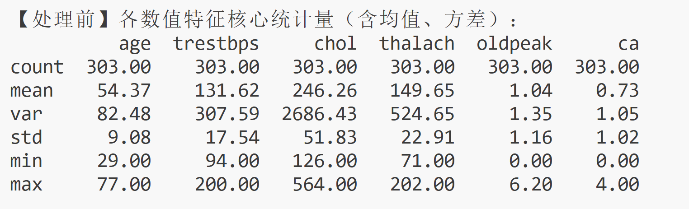
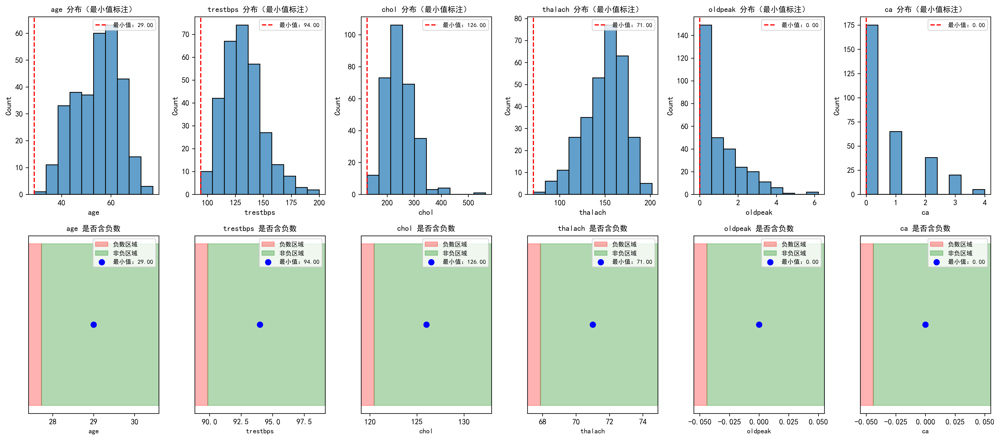
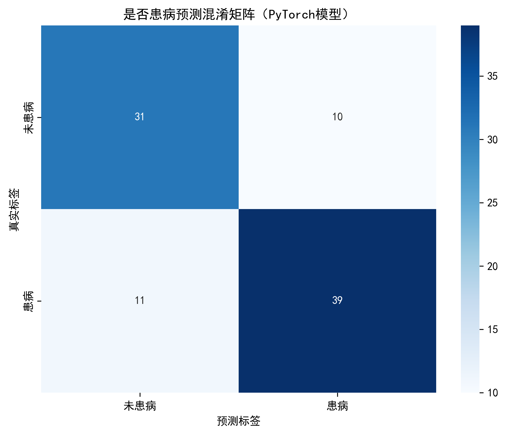
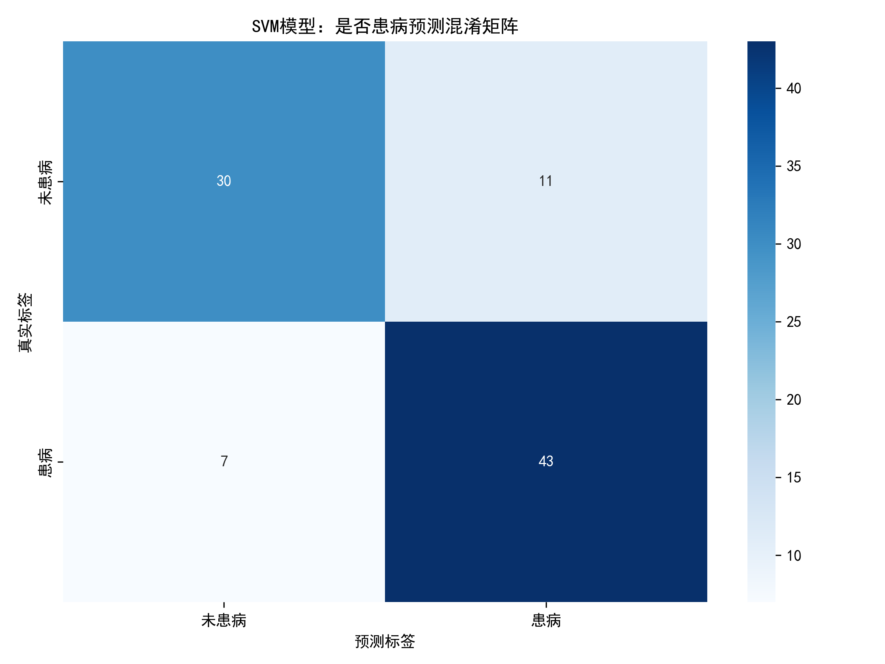
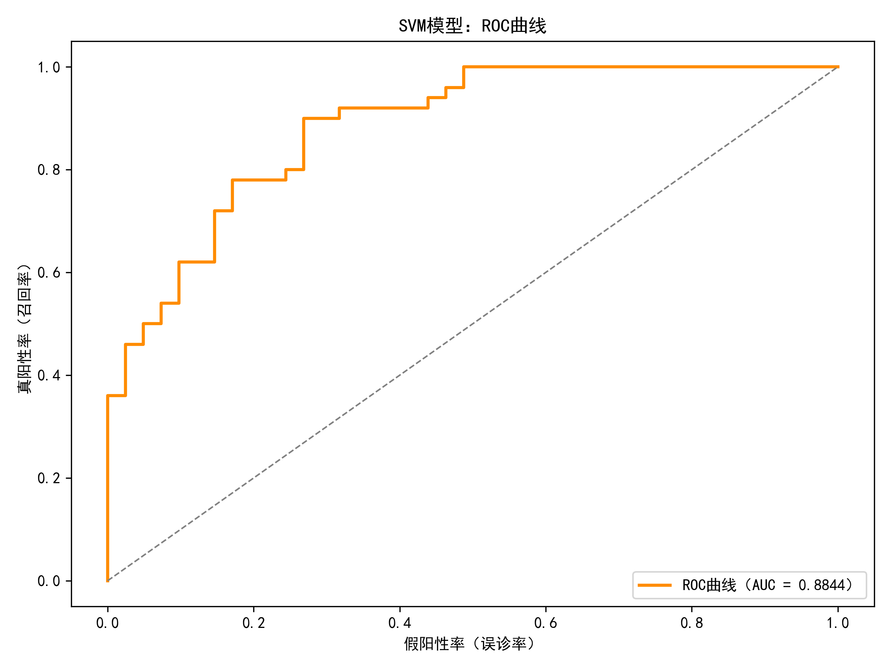

# 人工智能与机器学习作业1，用神经网络和支持向量机两种方法，对是否患有心脏病进行预测

## 1.数据处理与可视化
[processe_data.py](./processe_data.py)中对数据进行了处理和可视化 
数据处理：检测是否出现过不合理的值，比如异常的负数，将异常的值去除然后保存到[heart_clean_no_negative.csv](./heart_clean_no_negative.csv)文件中 
可视化：对数据的样本数量、均值、方差、标准差、最小值和最大值进行了统计

下图是对部分数据的可视化

## 2.分析

+ 分析目标：建立一个通过age,sex,cp,trestbps,chol,fbs,restecg,thalach,exang,oldpeak,slope,cathal数据来预测是否患有糖尿病的模型
+ 分析方法：
    + 方法一：
    神经网络：建立了含两层全连接隐藏层的神经网络，输入是上述的指标，输出是是否的病的概率。
    具体的模型定义和训练过程在[train.py](./train.py)
    训练的预测结果：
    准确率（Accuracy）：0.7692
    召回率（Recall，避免漏诊）：0.7800
    F1分数（综合精度与召回）：0.7879
    AUC值（概率区分能力）：0.8888
    
    
    并且把模型保存到了本地
    在本地预测的代码在[predict.py](./predict.py)
    + 方法二：
    SVM(支持向量机)：使用支持向量机对数据进行二分类
    训练和预测的代码都集成到了[SVM.py](./SVM.py)中
    模型的结果：
    准确率（Accuracy）：0.8022
    召回率（Recall，避免漏诊）：0.8600
    F1分数（综合精度与召回）：0.8269
    AUC值（概率区分能力）：0.8844
    
    